# 📸 Project Gallery - FortiStack Secure DevSecOps

This gallery showcases key milestones of the **FortiStack** DevSecOps project with infrastructure provisioning, security pipelines, container deployment, and Kubernetes orchestration.

---

## 🔧 Infrastructure Provisioning

- **VPC, Subnets, and NAT Gateway**
  

- **IAM Hardening**
  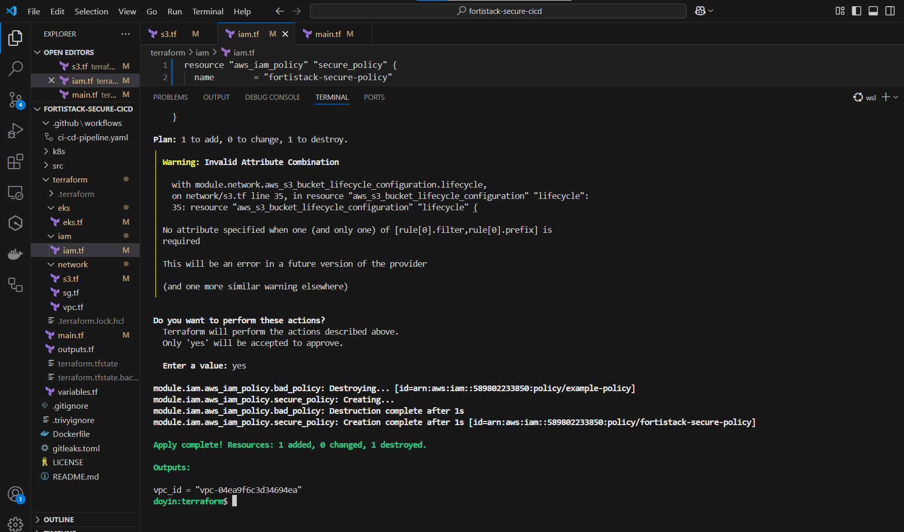

- **Terraform Planning**
  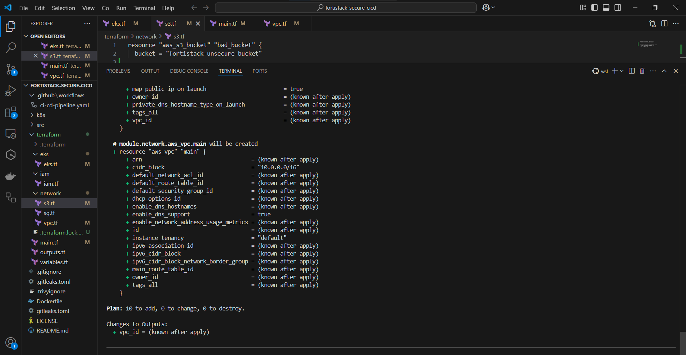

---

## ☁️ AWS Resources

- **EKS Cluster Deployment**
  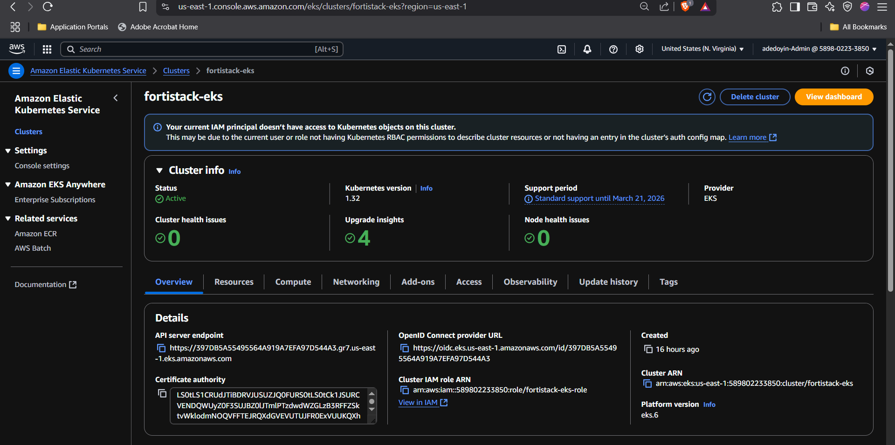

- **EC2 Bastion Host Access**
  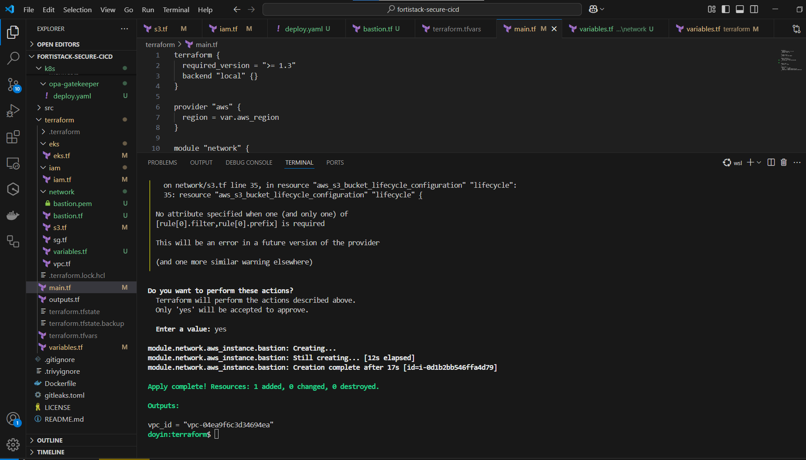

- **ECR Repository**
  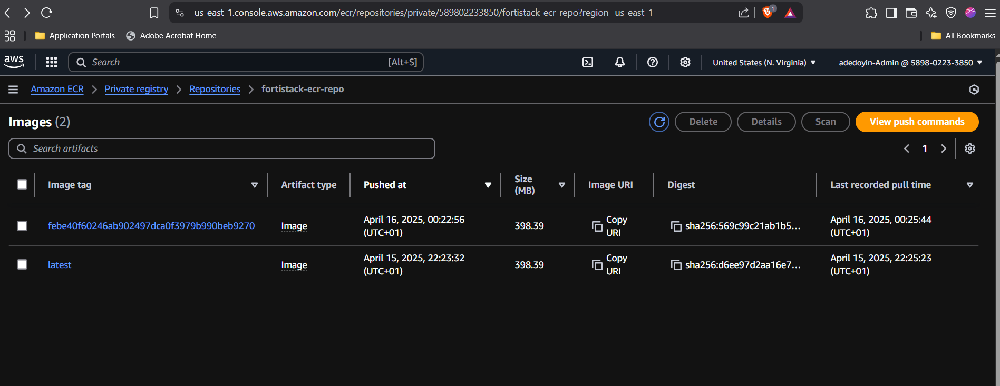

- **Docker Image Push**
  

---

## 🧪 Security Scans & Pipeline Activity

- **Gitleaks Local Test**
  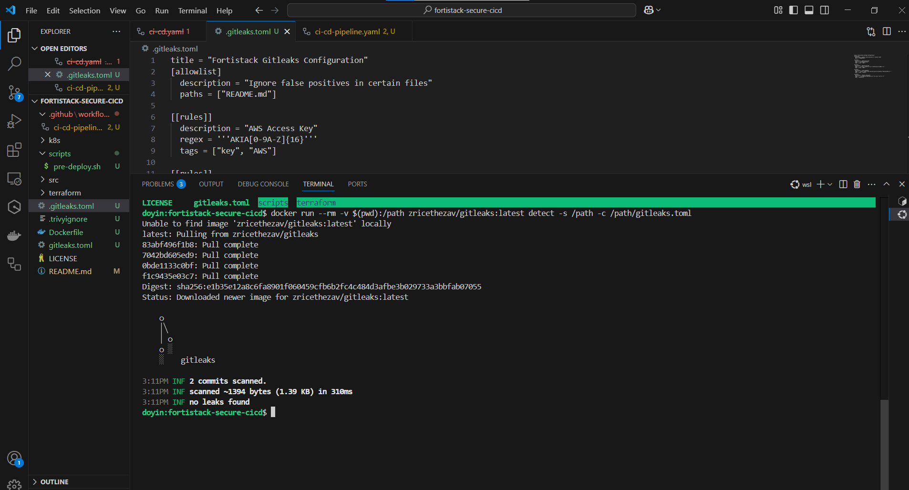

- **Checkov Scan (Failure Example)**
  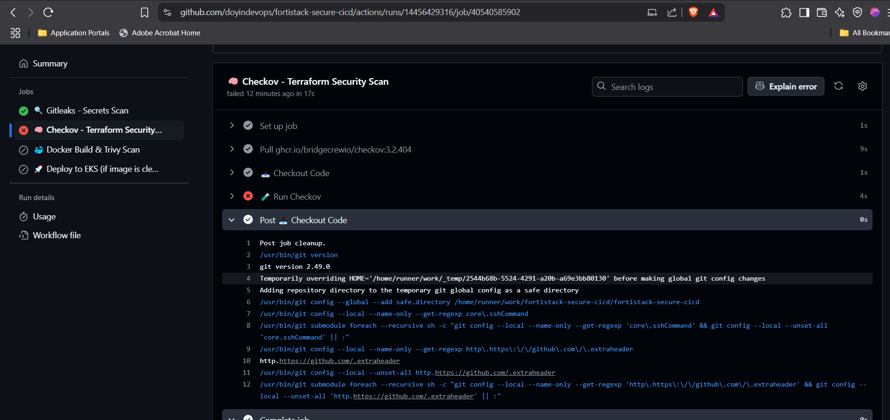

- **IAM Policy Review**
  

---

## 🚀 App Deployment & Kubernetes

- **Deployment Start**
  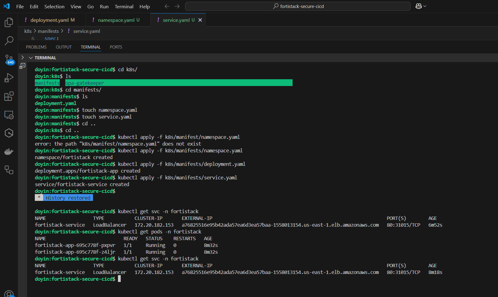

- **Kubernetes Service Exposure (LB)**
  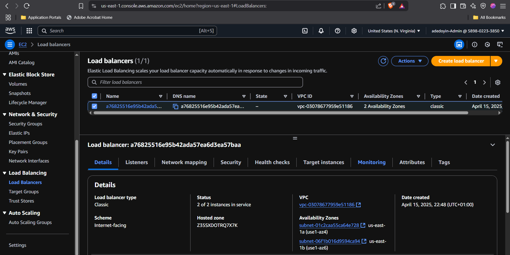

- **Successful Deployment**
  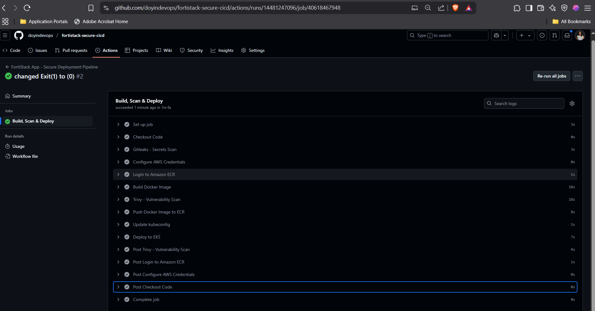

- **Pipeline Success**
  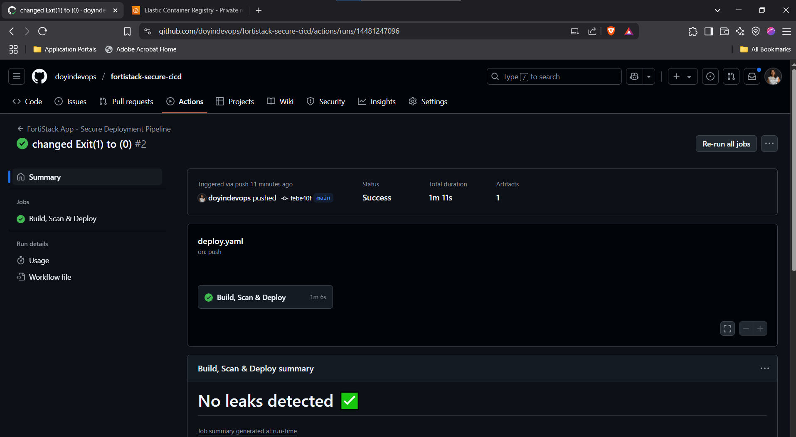

---

## 🌲 Project Directory

- **Directory Tree View**
  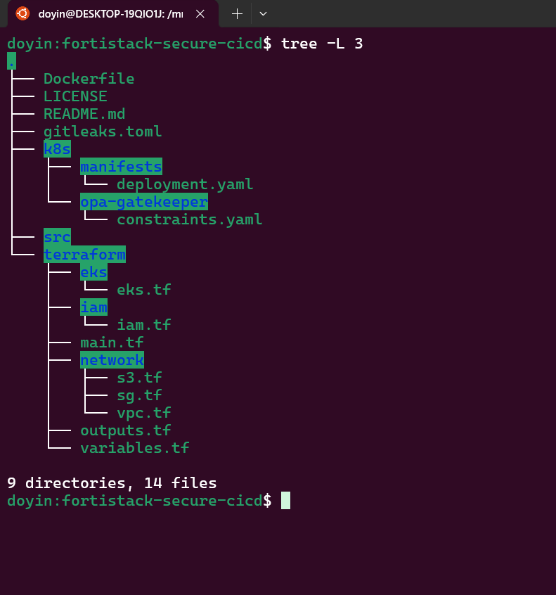
